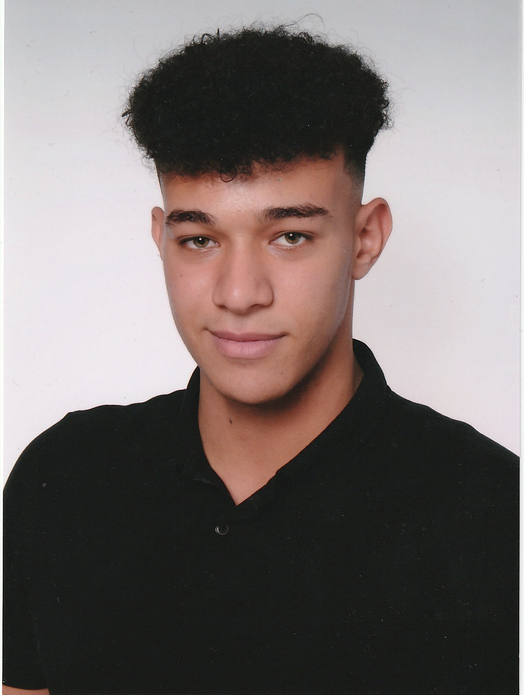
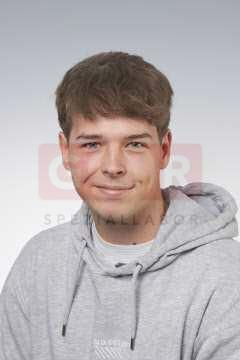
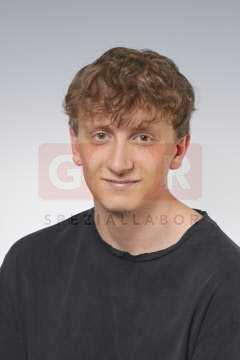
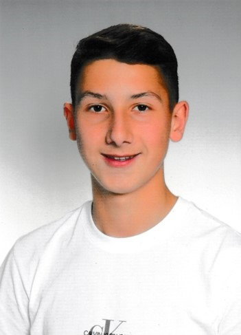

= EcoPoints
:revealjs_theme: white
ifndef::imagesdir[:imagesdir: ../images]

[.font-xx-large]
== Team

.Team
|===
|Name |Foto

|Abdullah Aldesoky
| 

|Oliver Daxinger
| 

|===

== Team

|===
|Name |Foto

|Laurent Mali
|

|Linus Nestler
| 

|Armin Salkovic
| 

|===

== EcoPoints

* "Fahrverhaltensvergleichsplattform"
* Vergleicht das Fahrverhalten von Fahrern
** Fahrer können freiwillig mitmachen
** Die Daten werden vom auto über dem OBD2 Port ausgelesen

[.font-xx-large]
== Sprint 1

* Jetpack-compose app
** Sensordaten auslesen
** Wer
*** Alle

[.font-xx-large]
== Sprint 2

* OBD2 Daten auslesen
** ELM327 über bluetooth
** Wer?
*** Linus, Oliver
* Oracle Server
** Quarkus backend
** Postgres Datenbank
** Wer?
*** Armin, Abdullah, Laurent

