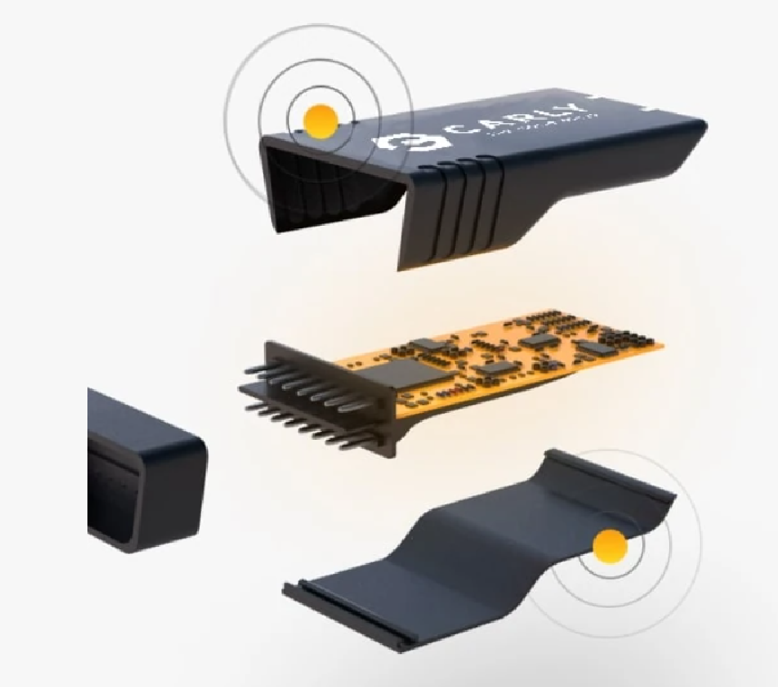

=== Wie funktioniert ein OBD2-Adapter?

* Autos heutzutage haben einen Universalanschluss (seit 2004 bei Diesel & 2001 bei Benziner) um an die Daten des Fehlerspeichers heranzukommen.
* Der Adapter wird in die OBD2-Buchse gesteckt und mit der heutigen Technologie gibt es viele Anwendungen auf dem Smartphone, mit denen man sich verbindet.
* Nach der Verbindung mit der Software kann der Adapter verschiedene Diagnosedaten aus dem Bordcomputer auslesen und anzeigen.
** z.B.: Geschwindigkeit, Drehzahl, Verbrauch, Fehlercodes, FIN (Fahrzeugidentifikationsnummer), Temperatur, etc.
* Die Software kann auch Fehlercodes auslesen und löschen.
* Die Fehlercodes sind so aufgebaut:
** Erster Buchstabe: P = Powertrain (Motor und Getriebe), B = Body (Karosserie), C = Chassis (Fahrwerk), U = Network (Netzwerk)
** Zweite Ziffer: 0 = Standardisierter Code, 1 = Herstellerspezifischer Code
** Dritte Ziffer: 0,1,2: Steuerung der Luft- und Kraftstoffdosierung, 3: Zündung, 4: Zusatzemissionen, 5: Leerlauf- und Geschwindigkeitsregelung, 6: Bordcomputer- und Ausgangsschaltungen, 7,8 & 9: Übertragungskontrollsystem
** Die letzten beiden Ziffern (00-99) geben die tatsächliche Fehlfunktion an.
* Die Anwendung zeigt die Fehler an und gibt eine kurze Beschreibung, was der Fehler bedeutet.

image::image-2024-01-23-10-31-34-114.png[]

=== Was ist ein OBD2-Adapter?

* OBD steht für On-Board-Diagnostics.
* Der Adapter ist ein Gerät, das in die OBD2-Buchse gesteckt wird und die Daten des Fahrzeuges ausliest.

=== Wie ist ein OBD2-Adapter aufgebaut?

* Der Adapter besteht aus einem Stecker, einem Mikrocontroller und einem USB-Kabel, WLAN- oder Bluetooth-Modul.

=== Wozu braucht man ein Smartphone dafür?

* Das Smartphone ist die "Schnittstelle" zwischen dem Adapter und dem Benutzer.
* Manche OBD-Adapter haben auch ein USB-Kabel, welches man an den Laptop anschließen kann.
* Laptop ist auch möglich, aber sehr groß und unhandlich.